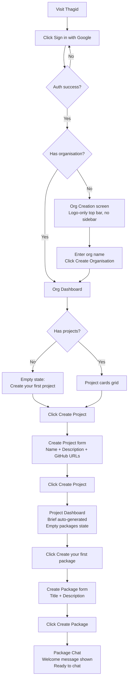
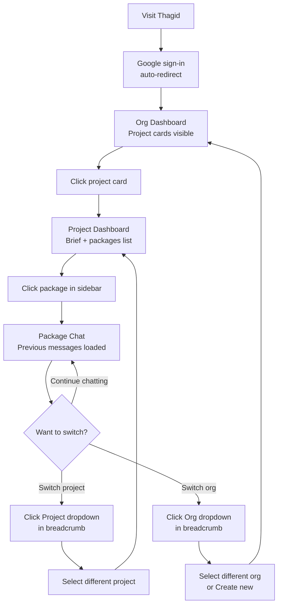
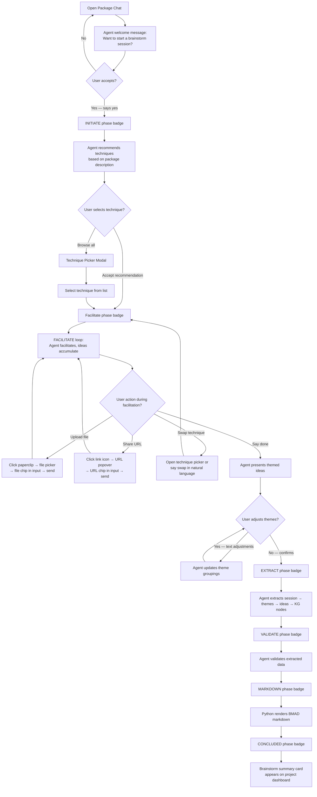
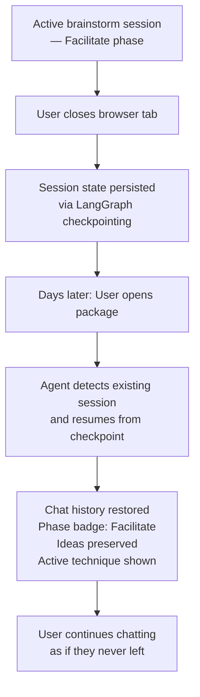
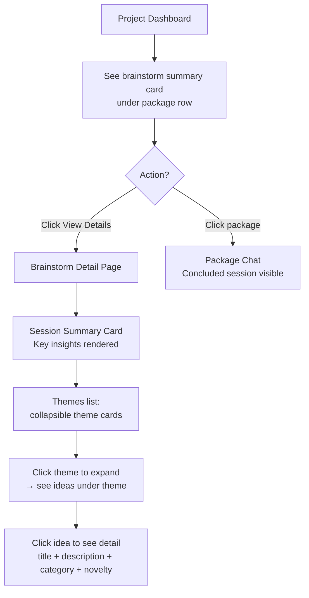

# UX Design Specification — Thagid

**Author:** Fmorais
**Date:** 2026-05-06

---

## Executive Summary

### Project Vision

Thagid is an automated end-to-end SDLC platform that orchestrates AI agent workflows through two surfaces: a ChatGPT-style web interface and a GitHub Projects kanban board. The web interface provides a guided, conversational layer where users manage organisations, projects, and packages. Each package is a scoped conversation where AI agents help define requirements, architecture, and UX. The kanban board is the execution surface — card movements trigger AI workflows that produce artifacts and update the board.

The prototype phase validates the structural skeleton and user flow with all LLM interactions stubbed (echo service). Desktop-only SPA built with SvelteKit + shadcn.

The brainstorm agent extends the prototype with real LLM interactions: a LangGraph state machine that facilitates ideation sessions, groups ideas into themes, writes structured data to a knowledge graph, and renders BMAD-compatible markdown. The UX covers the brainstorm session lifecycle — technique selection, file/URL ingestion, idea accumulation, theme grouping, session persistence, and result display.

### Target Users

Tech leads and developers at small-to-mid teams who currently manage SDLC manually across scattered tools — Google Docs for requirements, GitHub Issues for tracking, ad-hoc AI tool usage. They are comfortable with developer tools, GitHub, and chat interfaces. Desktop-only for MVP.

### Key Design Challenges

1. **Three-level scope clarity** — Users must always know where they are (org, project, or package scope) without confusion. The breadcrumb + sidebar combination must make scope transitions feel effortless.
2. **Scope-aware sidebar transitions** — The sidebar changes content when switching between org and project scope. This must feel natural, not jarring.
3. **Bridging web + kanban** — The web interface and GitHub kanban board are two separate surfaces. Users need clear links to the kanban and an understanding of how the two relate.
4. **First-time user onboarding** — The 7-step linear path from sign-up to chatting must have zero dead ends and clear empty states at every level.

### Design Opportunities

1. **Familiar patterns, novel combination** — ChatGPT-style chat + Supabase-style breadcrumbs + scope-aware sidebar. Each pattern is well-known individually, but combining them for SDLC orchestration is fresh.
2. **Minimal chrome, maximum clarity** — The AI-Native UI style matches the developer tool aesthetic: clean, focused, professional.
3. **Conversational package workflow** — Each package as a scoped conversation is inherently intuitive for developers familiar with ChatGPT/Claude interactions.

## Core User Experience

### Defining Experience

The core user action is chatting within a package — sending messages and receiving responses in a scoped conversation. This is the "ChatGPT moment" that defines Thagid's value. The critical interaction to nail is scope switching: the three-level hierarchy (org → project → package) is the structural innovation, and if navigating between scopes feels confusing, the whole product falls apart.

The transition from project dashboard → package chat is the key "aha" moment. The user sees their packages, clicks one, and immediately enters a focused conversational workspace.

### Platform Strategy

Desktop web SPA (SvelteKit + shadcn). Mouse and keyboard input. No offline functionality. No mobile or responsive requirements for MVP. Modern browsers only (Chrome, Firefox, Safari, Edge latest). Authenticated-only — no public/SEO pages.

### Effortless Interactions

1. **Google sign-up** — Zero forms, auto account creation. The user is in immediately.
2. **Scope switching via breadcrumbs** — Dropdown with search, click, done. No navigating back through pages.
3. **Sidebar context** — Changes automatically per scope, no user configuration needed.
4. **Empty states** — Every empty screen guides the user to the next action. No dead ends.

### Critical Success Moments

1. **First echo response** — User sends a message in a package and gets it echoed back. The skeleton works. The "it's real" moment.
2. **Scope clarity on return** — User opens the app a week later, navigates between projects and packages instantly. Everything is where they expect it.
3. **First project brief** — User creates a project and immediately sees a mock brief. The product shows its vision even in stub form.

### Experience Principles

1. **Scope is always clear** — Breadcrumbs and sidebar make the user's location obvious at every moment. No "where am I?" moments.
2. **Minimal friction, maximum flow** — Google auth, single-field org creation, focused forms. Every step in the happy path is as short as possible.
3. **Familiar patterns, zero learning curve** — ChatGPT chat, Supabase breadcrumbs. Developers know these patterns. Don't reinvent them.
4. **Progressive disclosure** — Brief shows summary first, expand for full detail. Packages show name + status, click for conversation. Reveal depth on demand.

## Desired Emotional Response

### Primary Emotional Goals

**Confident and in control.** The user always knows where they are in the scope hierarchy, what actions are available, and what comes next. No "what do I do now?" moments. Secondary feelings: calm focus (minimal chrome, clean interface), efficiency (every interaction is purposeful), and trust (the structure implies the platform can handle complexity even in stub form).

### Emotional Journey Mapping

| Stage | Feeling | Why |
|-------|---------|-----|
| First visit | Curiosity + mild skepticism | Another dev tool? Let's see. |
| Google sign-up | Relief | No forms, instant access. |
| Org creation | Confidence | One field. Done. |
| First project brief | Engagement | Auto-generated content shows vision. |
| First package chat | Validation | Echo response confirms the skeleton works. |
| Returning visit | Familiarity | Scope switching is second nature. |

### Micro-Emotions

- **Confidence vs. Confusion** — Most critical. The scope hierarchy (org → project → package) must prevent any confusion about location or context. Breadcrumbs + sidebar are the primary tools for this.
- **Accomplishment vs. Frustration** — Each completed step (org created, project created, package created) should give a clear sense of progress. Empty states celebrate the next step, not the absence of data.
- **Trust vs. Skepticism** — The mock brief + clean structure + familiar patterns build trust that the full product will deliver.
- **Calm focus vs. Overwhelm** — Minimal chrome. The design system's AI-Native UI style (no heavy decoration, clean spacing) directly supports this.

### Design Implications

- **Confidence** → Always-visible breadcrumbs, scope-aware sidebar, clear active states. The design system's sidebar patterns (active item highlighting, section labels) directly serve this.
- **Calm focus** → Generous whitespace, limited color palette (navy + neutral slate), no decorative elements. The design system's minimal chrome approach is aligned.
- **Accomplishment** → Success toasts after create actions, clear empty states with CTAs, brief auto-generation as a "reward" for project creation.
- **Trust** → Consistent interaction patterns (same form style for all creates, same card style for all lists), no visual surprises.

### Emotional Design Principles

1. **Never let the user feel lost** — Breadcrumbs, sidebar active states, and page titles work together to maintain orientation at all times.
2. **Celebrate progress, not absence** — Empty states are invitations ("Create your first project"), not failures. Create actions trigger success feedback.
3. **Consistency builds trust** — Same button styles, same card patterns, same form layouts across all scopes. Predictability is a feature.
4. **Calm over exciting** — This is a professional tool, not entertainment. Subtle transitions, clean spacing, muted colors. The interface should feel like a well-organized workspace.

### Brainstorm Emotional Journey

The brainstorm experience adds specific emotional moments to the base platform:

| Stage | Feeling | Why |
|-------|---------|-----|
| First technique recommendation | Validation | Agent understood the package context and picked something relevant. |
| First idea exchange | Momentum | Agent builds on input rather than reflecting it back. Ideation feels generative. |
| Accumulating ideas | Productive focus | Ideas building in real-time, visible in chat. The session feels productive. |
| Theme grouping reveal | Transformation | Messy ideas organized meaningfully. The "aha" moment — unstructured to structured. |
| BMAD markdown output | Accomplishment | Usable artifact without manual formatting. End-to-end validation. |
| Returning to resumed session | Trust | Session state preserved perfectly. The system respects the user's time. |

**Brainstorm emotional design implications:**
- **Ideation momentum** → Agent responses must feel generative (building on ideas) not reflective (echoing them back). The streaming indicator creates anticipation without anxiety.
- **Theme grouping "aha"** → Theme card presentation must be visually clear and organized. Collapsible themes let users explore without overwhelm. The transition from chaos to structure should feel satisfying.
- **Session trust** → No save buttons, no confirmation dialogs. Persistence is invisible and assumed. The user never worries about losing work.

## UX Pattern Analysis & Inspiration

### Inspiring Products Analysis

**ChatGPT** — The primary layout reference. Left sidebar with conversation list + main area for chat creates an instant mental model. Chat bubbles differentiate user vs assistant clearly. Sticky bottom input with Enter-to-send is the expected pattern. Avoid: sidebar clutter when many conversations exist (mitigated by search and prototype scope).

**Supabase** — The navigation reference. Breadcrumb dropdowns in the top bar (org → project) with search + list + create in each popover enable fast switching. Changing project instantly updates all context — sidebar, content, breadcrumbs. Clean white UI with subtle borders sets the professional developer aesthetic. Avoid: settings buried in sidebar (we surface Settings as a top-level item).

**Linear** — Peer reference for developer tool UX. Status badges with clear visual progression. Empty states that are centered with a single CTA. Keyboard-first design (noted for future, not prototype). Minimal chrome with purposeful use of color.

**GitHub Projects** — The external kanban surface. Not part of Thagid's UI but critical context: users manage cards on GitHub, Thagid links out. Requires clear external link patterns (secondary buttons with external-link icon).

### Transferable UX Patterns

**Navigation patterns:**
- Breadcrumb dropdown switching (Supabase) → org and project scope switching in top bar
- Scope-aware sidebar content (Supabase) → sidebar changes per org/project/package scope
- Flat sidebar with section dividers (Linear) → project scope sidebar with nav section + packages section

**Interaction patterns:**
- Chat bubble layout (ChatGPT) → user right-aligned colored, assistant left-aligned neutral
- Sticky chat input (ChatGPT) → textarea at bottom with send button, Enter/Shift+Enter
- Inline status badges (Linear) → package status with color-coded pill badges
- Empty state with single CTA (Linear) → centered icon + heading + description + button

**Visual patterns:**
- Minimal chrome, white surfaces (Supabase, Linear) → clean developer tool aesthetic
- Navy primary + neutral slate palette (design system) → professional, calm color palette
- Subtle transitions 150-200ms (all references) → smooth but not distracting

### Anti-Patterns to Avoid

1. **Jira-style information density** — Too many fields, panels, and metadata visible at once. Thagid should feel light and focused.
2. **Multi-level nested navigation** — No three-click-deep menus. Flat sidebar items + breadcrumb switching. Max two clicks to anywhere.
3. **Modal-heavy workflows** — Create forms are pages, not modals. Modals for confirmations only.
4. **Undifferentiated lists** — Every list item needs visual hierarchy (title + description + status). Not just text rows.

### Design Inspiration Strategy

**Adopt directly:**
- ChatGPT: Chat bubble layout, sticky input, send interaction pattern
- Supabase: Breadcrumb dropdown switching, scope-aware UI updates
- Linear: Status badge pattern, empty state pattern, minimal chrome aesthetic

**Adapt for Thagid:**
- ChatGPT sidebar → scope-aware sidebar that changes content per context (org vs project)
- Supabase breadcrumb → three-level scope (org → project → package) instead of two

**Avoid:**
- Jira-style density, nested menus, modal-heavy creation, undifferentiated lists

**Note for future (not prototype):**
- Keyboard shortcuts (Cmd+K palette, keyboard navigation)
- Typing indicators for real AI responses
- Real-time updates when kanban cards move

## Design System Foundation

### Design System Choice

**shadcn-svelte with custom theming.** The full design system is documented at `design-system/thagid/` with a MASTER.md (global source of truth) and 5 page-specific overrides (layout, org dashboard, project dashboard, package chat, forms). All UX implementation must follow the design system. Deviations require explicit approval with justification.

### Rationale for Selection

1. **Themeable system** — shadcn-svelte provides well-built, accessible components customized with our own tokens. Not a rigid established system (too opinionated), not fully custom (too much work for prototype).
2. **Custom color palette** — Navy primary (`#0A3B85`), neutral slate surfaces. Differentiates Thagid from default shadcn while leveraging the component architecture. Full palette documented in `design-system/thagid/MASTER.md`.
3. **Tailwind CSS variable mapping** — shadcn-svelte uses Tailwind CSS variables, so our color tokens map directly. No abstraction mismatch.
4. **Component coverage** — Card, Button, Input, Dialog, Badge, Popover, Collapsible, Sidebar cover all prototype screens. No custom component library required.
5. **Page-specific overrides** — The `design-system/pages/` pattern defines per-page deviations without bloating the global spec.

### Implementation Approach

- shadcn-svelte CLI to scaffold components
- Override Tailwind CSS variables with Thagid's color tokens
- Lucide icons via `lucide-svelte` (shadcn's default icon set)
- Plus Jakarta Sans loaded via Google Fonts CSS import
- Follow page overrides when building each screen

### Customization Strategy

**What stays default:** Component structure, accessibility patterns, keyboard handling.
**What we customize:** Colors (CSS variables), typography (font family override), spacing (Tailwind config), component variants (status badge colors).
**What we build custom:** Chat interface (no shadcn chat component), breadcrumb dropdown system (Popover + custom list), scope-aware sidebar content switching, brainstorm-specific components (streaming indicator, technique picker modal with two-column layout, idea cards, theme cards with collapsible behavior, file/URL attachment chips).

## Core Interaction Design

### Defining Experience

"Open a package and start a scoped conversation about your release." The user clicks a package in the sidebar, the chat loads instantly, and they are in a focused conversational workspace that knows exactly what project they are in, what org they belong to, and what package they are working on. The scope is implicit — visible in breadcrumbs and sidebar, but never demanding attention.

### User Mental Model

Users already know the ChatGPT interaction model: type a message, get a response, iterate. They bring zero learning curve to the chat itself. What is new is the scoping — this conversation belongs to "v1.0 Core API" within "Thagid Web App" within "Acme Dev Team." Users currently solve SDLC collaboration in Google Docs, Slack threads, or ChatGPT conversations with manually pasted context. Thagid makes the scope automatic.

**Potential confusion points:**
- "Which package am I in?" — mitigated by breadcrumbs + chat header showing package name + status badge
- "How do I get back to my project?" — mitigated by sidebar always showing project navigation
- "What is the difference between a project and a package?" — mitigated by the creation flow: project = product, package = release

### Success Criteria

1. **Chat feels instant** — Echo responds immediately. No loading spinners between message and response.
2. **Scope is always implicit** — User never has to ask "where am I?" Breadcrumbs, sidebar, and chat header answer this passively.
3. **Package entry is one click** — From sidebar package list to chat loaded. No intermediate screens.
4. **The interface disappears** — During active chat, the user focuses on the conversation. The sidebar and top bar recede. Chat takes visual priority.

### Novel vs. Established Patterns

The core experience uses established patterns combined in a novel way:
- **Chat interaction:** established (ChatGPT pattern) — zero innovation needed
- **Scope hierarchy:** established patterns combined (Supabase breadcrumbs + scope-aware sidebar) — the combination is the novel element
- **Unique twist:** conversations are scoped to packages within a project hierarchy. This is not a generic chatbot — every message exists in organizational context.

No user education needed. Developers already know all three patterns individually.

### Experience Mechanics

**1. Initiation:** User clicks a package name in the sidebar (or arrives after creating a new package). The chat loads with a welcome message from the assistant.

**2. Interaction:** User types in the sticky bottom textarea. Presses Enter (or clicks Send). The user message appears as a right-aligned primary-colored bubble (`#0A3B85` background, white text). The assistant echo appears immediately below as a left-aligned neutral bubble (`bg-slate-100`, `#0F172A` text). The view auto-scrolls to the latest message.

**3. Feedback:** New messages animate in (fade + slide-up, 200ms). The send button is disabled when input is empty, enabled with primary navy (`#0A3B85`) when text is present. After sending, the input clears. For prototype: echo is instant. For brainstorm: streaming indicator (3-dot pulse) while LLM processes, then streaming text with blinking cursor.

**4. Completion:** Conversations are open-ended — no "done" state for MVP. The user can switch packages via sidebar at any time. Chat history persists for the session.

## Visual Design Foundation

### Color System

Navy primary (`#0A3B85`) + neutral slate palette on a subtle slate-50 (`#F8FAFC`) background. The palette supports the emotional goals of calm focus (muted, non-aggressive colors) and confidence (clear visual hierarchy, high contrast). Six status colors provide immediate package status recognition. Six brainstorm phase colors provide state machine visibility. Full palette documented in `design-system/thagid/MASTER.md`.

### Typography System

Plus Jakarta Sans — single font family, variable weight 300-700. Friendly, modern, professional. Optimized for UI readability at 14px body text. Type scale: `text-xs` (12px, captions/status) through `text-2xl` (24px, page titles). No serif/heading pairing to maintain a clean, consistent interface.

### Spacing & Layout Foundation

4px base unit with a 6-step scale (4/8/16/24/32/48px). Layout is balanced: fixed top bar (`h-14`) + sidebar (`w-64`) + main content (`flex-1`, `p-6`). Not dense (avoids Jira-style information overload), not airy (avoids marketing-site emptiness). Grid layouts are context-dependent: 3-column for project cards, stacked rows for package lists.

### Accessibility Considerations

- All text meets WCAG AA 4.5:1 contrast minimum
- Visible focus rings on all interactive elements
- `prefers-reduced-motion` respected — all animations disabled when active
- Keyboard navigation follows visual tab order
- Semantic HTML via shadcn component architecture

## Design Direction Decision

### Design Directions Explored

The design direction was established prior to this UX workflow through a structured brainstorming session and design system creation. No competing visual directions were generated — the product owner had a clear, well-articulated vision for the interface structure (ChatGPT-style chat + Supabase-style breadcrumbs + scope-aware sidebar) that was documented in the brainstorming session and directly translated into a comprehensive design system.

### Chosen Direction

**AI-Native UI** — minimal chrome, professional developer tool aesthetic. Navy primary (`#0A3B85`) color palette. ChatGPT-style chat interface within packages. Supabase-style breadcrumb dropdown navigation for cross-scope switching. Scope-aware sidebar with two variants (organisation scope and project scope). Desktop-only SPA built with SvelteKit + shadcn-svelte.

### Design Rationale

1. **Familiar patterns** — Developers already know ChatGPT and Supabase. Zero learning curve.
2. **Minimal chrome** — Matches the emotional goal of calm focus. No decorative elements competing for attention.
3. **Scope clarity** — Three-level hierarchy (org → project → package) is the core structural innovation. Breadcrumbs + sidebar make it always visible without demanding attention.
4. **Progressive disclosure** — Brief summary then expand, package name + status then click for chat. Reveal depth on demand.
5. **shadcn-svelte** — Proven component library with accessibility built-in. Customized with Thagid's color tokens and typography.

### Implementation Approach

The full design system is documented at `design-system/thagid/` with:
- **MASTER.md** — Global source of truth (colors, typography, spacing, components, navigation, animations)
- **pages/layout.md** — Top bar + sidebar shell implementation
- **pages/organisation-dashboard.md** — Org dashboard, org settings, first-time org creation
- **pages/project-dashboard.md** — Project dashboard, project settings, brainstorm summary card
- **pages/package-chat.md** — Chat interface with brainstorm-specific interactions (phase badge, technique picker, file/URL attachments, theme grouping)
- **pages/brainstorm-detail.md** — Brainstorm detail view with session summary, theme cards, idea browsing
- **pages/forms.md** — Shared create/edit form patterns

All implementation must follow the design system. Deviations require explicit approval with justification.

## User Journey Flows

### Journey 1: First-Time Setup

Ana signs up and reaches her first package chat in 7 linear steps.

**Screen sequence with UI state:**

| Step | Screen | Top bar | Sidebar | Main content |
|------|--------|---------|---------|-------------|
| 1 | Google sign-up | — | — | Google OAuth button |
| 2 | Org creation | Logo only | None | Name input + Create button |
| 3 | Org dashboard | Logo / Org name | Org scope | Empty state with CTA |
| 4 | Create project | Logo / Org name | Org scope | Project form (4 fields) |
| 5 | Project dashboard | Logo / Org / Project name | Project scope | Brief + GitHub links + Empty packages |
| 6 | Create package | Logo / Org / Project name | Project scope | Package form (2 fields) |
| 7 | Package chat | Logo / Org / Project name | Project scope (package active) | Chat interface |

### Journey 2: Returning User

Ana returns a week later and navigates her existing setup via scope switching.

**Navigation patterns:**

- **Breadcrumb dropdown switch:** Click org/project name in top bar, popover with search + list, click item, entire UI updates
- **Sidebar navigation:** Click nav item (Dashboard, Settings) or package name, main content updates, sidebar highlights active item
- **Direct URL:** Bookmark any route (/project/X/package/Y), loads with correct scope context

### Edge Cases & Error States

1. **Google auth failure:** Error message with retry button. Stays on sign-up screen.
2. **Invalid form input:** Inline validation on blur + submit. Red border + error message below field. Form does not submit until valid.
3. **Empty states:** Every list view has an empty state variant (org dashboard, packages list). Centered layout with icon, heading, description, and CTA.
4. **Direct URL access:** Routes load with correct scope context. Breadcrumbs and sidebar render based on URL parameters.
5. **Network errors:** Toast notification with retry option. No silent failures.

### Journey Patterns

1. **Create flow:** CTA button, form page (max-w-lg, centered), fill required fields, submit, redirect to detail view with success toast.
2. **Scope switch:** Click breadcrumb dropdown, search/filter list, click item, sidebar + breadcrumbs + main content update simultaneously.
3. **Empty state:** Centered layout, large Lucide icon (w-12 h-12, slate-300), heading (text-lg), description (text-sm, slate-500), CTA button.
4. **Error recovery:** Inline field validation. No modal errors for forms. Toast for system-level errors with retry.

### Flow Optimization Principles

1. **Minimum steps to value:** The happy path is 7 steps from zero to chatting. Each step is one focused action (one field, one form, one click).
2. **No backtracking required:** Linear flow. The user never needs to go back to complete a step.
3. **Progressive disclosure:** Each screen reveals the next action. Empty states serve as invitations, not blockers.
4. **Consistent feedback:** Every create action redirects to detail with success toast. Every form error shows inline message. Every navigation gives instant visual update.

### Journey 3: First Brainstorm Session

Fmorais creates a new package and starts a brainstorm session. The agent reads the package description, recommends techniques, facilitates ideation, groups ideas into themes, and writes everything to the knowledge graph.

**Screen states during brainstorm:**

| Phase | Chat Header | Chat Content | Chat Input |
|-------|------------|-------------|-----------|
| Initiate | Phase badge: Initiate (indigo) | Technique recommendation cards | Enabled |
| Facilitate | Phase badge: Facilitate (blue) | Idea cards inline, file/URL acknowledgements | Enabled + file/URL buttons |
| Extract | Phase badge: Extract (amber) | Theme cards with ideas | Enabled (adjustments) |
| Validate | Phase badge: Validate (violet) | Brief validation message | Disabled |
| Markdown | Phase badge: Markdown (green) | BMAD markdown output | Disabled |
| Concluded | Phase badge: Concluded (slate) | Session summary | Disabled |

### Journey 4: Session Abandoned and Resumed

Fmorais starts a brainstorm but leaves mid-session. Returns days later and resumes exactly where they left off.

**Key UX behavior:** No save button, no confirmation dialog, no "resume session?" prompt. The session just resumes. The chat history loads, the phase badge shows the correct state, and the facilitator continues.

### Journey 5: Reviewing Brainstorm Results

A week later, Fmorais opens the package and reviews the brainstorm results.

## Component Strategy

### Design System Components (shadcn-svelte)

The following components are provided by shadcn-svelte and require no custom implementation:

- **Button** — All variants (primary CTA, secondary, ghost, destructive). Mapped to shadcn Button with custom color tokens.
- **Input / Textarea / Label** — Standard form components for all create/edit screens.
- **Card** — Project cards on org dashboard. CardHeader + CardTitle + CardDescription + CardContent composition.
- **Badge** — Base for StatusBadge extension.
- **Popover** — Base for BreadcrumbDropdown. PopoverTrigger + PopoverContent with custom list content.
- **Dialog** — Modal overlays for future confirmation dialogs.
- **Sidebar** — Base layout component. SidebarProvider + Sidebar + SidebarContent + SidebarMenu + SidebarMenuItem + SidebarMenuButton.
- **Collapsible** — Brief section expand/collapse on project dashboard.
- **Toast / Toaster** — Success/error notifications after create/save actions.

### Custom Components

#### ChatInterface

**Purpose:** Full chat view for package conversations. Message display area + sticky input at bottom.
**Anatomy:** Chat header (sticky top, h-16, package title + status badge + border-b) → Message area (flex-1, overflow-y-auto, p-6, gap-4) → Input area (sticky bottom, bg-white, border-t, p-4, textarea + send button)
**States:** Empty (welcome assistant message only), active conversation, sending (streaming indicator for brainstorm), brainstorm active (phase badge visible, file/URL buttons enabled during Facilitate, disabled during other phases)
**Accessibility:** Message area has `role="log"`, `aria-live="polite"`. Input has associated label. Enter sends, Shift+Enter for newline.

#### ChatBubble

**Purpose:** Single message in the conversation. Two variants: user and assistant.
**Anatomy:** Container (flex, alignment) → Bubble (background, border-radius with directional corner cut) → Text content → Timestamp (optional, text-xs text-slate-400 below bubble)
**Variants:** `user` (ml-auto, bg-primary #0A3B85, white text, rounded-2xl rounded-br-md, max-w-[70%]) and `assistant` (mr-auto, bg-slate-100, border border-slate-200, #0F172A text, rounded-2xl rounded-bl-md, max-w-[70%])
**Animation:** animate-in fade-in slide-in-from-bottom-2 duration-200
**Accessibility:** `role="article"`, `aria-label` with sender role.

#### BreadcrumbDropdown

**Purpose:** Clickable breadcrumb segment in top bar that opens a popover for scope switching.
**Anatomy:** Trigger (text-sm font-medium text-primary, chevron-down icon 12px) → Popover (w-72, max-h-80) → Search input (standard input with search icon, filters list) → List items (p-3, hover bg-slate-50, active bg-primary/10, current item has check icon) → Create button (full-width ghost, plus icon, at bottom)
**States:** Closed, open, active search, empty search results
**Accessibility:** Trigger has `aria-haspopup="listbox"`. List items keyboard-navigable. Escape closes popover.

#### EmptyState

**Purpose:** Centered empty state for lists with no items. Used for org dashboard (no projects), packages list (no packages).
**Anatomy:** Container (centered, text-center) → Icon (Lucide component, w-12 h-12 text-slate-300) → Heading (text-lg font-semibold text-slate-900) → Description (text-sm text-slate-500 max-w-sm) → CTA button (primary CTA variant)
**Props:** `icon`, `heading`, `description`, `actionLabel`, `actionHref`
**Accessibility:** Icon has `aria-hidden="true"`. Heading provides context. CTA has clear label.

#### StatusBadge

**Purpose:** Package status indicator with color-coded background and text.
**Anatomy:** Extends shadcn Badge. h-6, px-2.5, rounded-full, text-xs font-medium. No border.
**Variants:** `new` (text indigo-500, bg indigo-50), `planning` (text amber-500, bg amber-50), `in-progress` (text blue-600, bg blue-50), `finished` (text green-500, bg green-50), `released` (text violet-500, bg violet-50), `cancelled` (text slate-400, bg slate-100). See `design-system/thagid/MASTER.md` for full status and brainstorm phase color tables.

#### BrainstormPhaseBadge

**Purpose:** Shows current brainstorm state machine phase in the chat header. Visual indicator of where the session is in the INITIATE → FACILITATE → EXTRACT → VALIDATE → MARKDOWN → CONCLUDED lifecycle.
**Anatomy:** Extends StatusBadge pattern. h-6, px-2.5, rounded-full, text-xs font-medium. No border.
**Variants:** `initiate` (text indigo-500, bg indigo-50), `facilitate` (text blue-600, bg blue-50), `extract` (text amber-500, bg amber-50), `validate` (text violet-500, bg violet-50), `markdown` (text green-500, bg green-50), `concluded` (text slate-400, bg slate-100). Colors match `design-system/thagid/MASTER.md` brainstorm phase table.
**Behavior:** Badge text and color update as the brainstorm agent transitions between phases. Only visible when a brainstorm session is active for the package.

#### TechniquePickerModal

**Purpose:** Browse and select from 62 brainstorming techniques. Two-column layout with searchable list and detail panel.
**Anatomy:** shadcn Dialog (max-w-2xl, wider than standard modals) → Left column (search bar + filter chips + scrollable technique list, max-h-[400px]) → Right column (selected technique detail + "Select Technique" primary CTA).
**States:** Closed, open with no selection, open with technique selected, search active with no results.
**Interactions:** Search filters technique list by name. Filter chips filter by category. Click technique item → right panel shows detail. Click "Select Technique" → modal closes, technique applied.
**Accessibility:** Focus trap within modal. Escape closes. Search input auto-focused on open. Technique items keyboard-navigable. shadcn Dialog + Command composition. Full spec in `design-system/thagid/MASTER.md` → Technique Picker Modal.

#### IdeaCard

**Purpose:** Displays a single brainstorm idea within assistant chat bubbles or detail views.
**Anatomy:** Container (bg-white, border border-slate-200, rounded-lg, p-4) → Title row (lightbulb icon + idea title, text-sm font-semibold text-slate-900) → Description (text-sm text-slate-600, mt-1) → Footer (category tag pill + novelty indicator, text-xs).
**Variants:** `inline` (within chat bubble, non-interactive, no hover) and `detail` (within brainstorm detail page, interactive with hover shadow).
**Accessibility:** `role="article"`, `aria-label` with idea title. Full spec in `design-system/thagid/MASTER.md` → Idea Card.

#### ThemeCard

**Purpose:** Displays a group of ideas under a theme label. Used during theme grouping (Extract phase) and in brainstorm detail view.
**Anatomy:** Container (bg-white, border border-slate-200, rounded-xl, p-5) → Header row (layers icon + theme name, text-base font-semibold text-slate-900 + idea count badge, text-xs text-slate-400) → Ideas list (stacked idea cards with compact layout, gap-2).
**Behavior:** Collapsible. Click header toggles idea list visibility. Collapsed shows header + count only. Expanded shows all ideas.
**Accessibility:** Header button has `aria-expanded`. Full spec in `design-system/thagid/MASTER.md` → Theme Card.

#### FileUrlAttachmentChips

**Purpose:** Shows pending file/URL attachments in chat input area and uploaded attachments in chat bubbles.
**Anatomy — File chip:** Container (bg-slate-100, rounded-lg, px-3 py-1.5) → file icon + filename (text-sm text-slate-700, truncate max-w-[200px]) + x remove button. Max width max-w-[280px].
**Anatomy — URL chip:** Container (bg-blue-50, rounded-lg, px-3 py-1.5) → link icon + domain (text-sm text-primary, truncate max-w-[200px]) + x remove button. Max width max-w-[280px].
**States:** Pending (in input area, removable), attached (in message bubble, not removable).
**Accessibility:** Remove button has `aria-label="Remove attachment"`. Full spec in `design-system/thagid/MASTER.md` → File/URL Attachment Chips.

#### StreamingIndicator

**Purpose:** Shows when the brainstorm agent is generating a response. Replaces the echo-style instant response.
**Anatomy — Dot indicator:** Container (bg-slate-100, rounded-2xl rounded-bl-md, px-4 py-3, left-aligned) → 3 circles (w-2 h-2 rounded-full bg-slate-400) with staggered animate-bounce (delay-0, delay-150, delay-300).
**Anatomy — Streaming text:** Same container → partial text with blinking cursor (w-0.5 h-4 bg-slate-900 animate-pulse) at end. Max width max-w-[70%].
**Behavior:** Shows dot indicator first, then transitions to streaming text as tokens arrive. Replaced by full ChatBubble when response complete.
**Accessibility:** `aria-live="polite"`, `aria-label="Agent is responding"`. Full spec in `design-system/thagid/MASTER.md` → Streaming / Typing Indicator.

#### BrainstormSummaryCard

**Purpose:** Shows brainstorm session summary on the project dashboard below the package row.
**Anatomy:** Container (bg-white, border border-slate-200, rounded-xl, p-5, mt-2) → Header row (lightbulb icon + "Brainstorm" + date, text-sm font-semibold text-slate-900) → Stats row (technique count · idea count · theme count, text-xs text-slate-500) → Theme pills (horizontal row, gap-2 flex-wrap, mt-3, each: text-xs font-medium px-2.5 py-1 rounded-full bg-slate-100 text-slate-600, format "{Name} ({count})", max 5 shown + "+N more") → "View Details" link (text-sm font-medium text-primary, right-aligned).
**Visibility:** Only shown when package has a concluded brainstorm session.
**Accessibility:** "View Details" is a link with clear navigation purpose. Full spec in `design-system/thagid/pages/project-dashboard.md` → Brainstorm Summary Card.

### Component Implementation Strategy

- All custom components use design system tokens (colors, spacing, typography, shadows)
- All custom components follow shadcn's accessibility patterns (ARIA labels, keyboard navigation)
- ChatInterface and ChatBubble are the most complex custom components with no shadcn equivalent
- Brainstorm components (IdeaCard, ThemeCard, TechniquePickerModal) add rich content within assistant chat bubbles
- BreadcrumbDropdown composes shadcn Popover with custom list content
- EmptyState and StatusBadge are simple, high-reuse components
- ScopeAwareSidebar wraps shadcn Sidebar with conditional content rendering based on current scope
- StreamingIndicator replaces the echo-style instant response for brainstorm sessions

### Implementation Roadmap

**Phase 1 — Shell (all screens depend on these):**
- ScopeAwareSidebar (shadcn Sidebar + content switching logic)
- BreadcrumbDropdown (Popover + custom list)
- EmptyState (simple, reusable in 3+ screens)

**Phase 2 — Org & Project dashboards:**
- StatusBadge (extend shadcn Badge with 6 status variants)
- ProjectCard (shadcn Card composition)
- PackageListItem (composition with StatusBadge)

**Phase 3 — Chat:**
- ChatBubble (user + assistant variants)
- ChatInterface (message area + auto-growing textarea + send button)

**Phase 4 — Brainstorm components:**
- BrainstormPhaseBadge (extends StatusBadge with 6 phase variants)
- StreamingIndicator (dot indicator + streaming text)
- IdeaCard (inline + detail variants)
- ThemeCard (collapsible with idea list)
- TechniquePickerModal (Dialog + Command + two-column layout)
- FileUrlAttachmentChips (file + URL variants)
- BrainstormSummaryCard (for project dashboard)

## UX Consistency Patterns

### Button Hierarchy

| Priority | Variant | Color | When to use |
|----------|---------|-------|-------------|
| Primary | CTA (navy) | `#0A3B85` bg, white text | Create, Save — one per screen |
| Secondary | Secondary | `#F1F5F9` bg, `#0F172A` text | Cancel, non-primary actions |
| Tertiary | Ghost | transparent bg, `#475569` text | Sidebar items, toolbar actions, inactive states |
| Destructive | Red | `#EF4444` bg, white text | Delete actions (future) |

**Rules:** Only one CTA button per screen. CTA always right-aligned. Cancel always left of CTA. All buttons h-10, rounded-lg, transition-colors duration-200. See `design-system/thagid/MASTER.md` for full button variants.

### Feedback Patterns

| Situation | Pattern | Implementation |
|-----------|---------|---------------|
| Create/Save success | Toast notification | shadcn Toast, auto-dismiss after 3s, green accent |
| Form validation error | Inline field error | Red border + text-xs text-red-500 message below field |
| System/network error | Toast notification | Toast with retry button, persists until dismissed |
| Loading content | Skeleton pulse | Gray placeholder shapes, animate-pulse 1.5s infinite |
| Empty list | EmptyState component | Icon + heading + description + CTA button |
| Chat message sent | Bubble animation | fade-in slide-in-from-bottom-2 duration-200 |
| Brainstorm response generating | StreamingIndicator | Dot pulse → streaming text with blinking cursor |
| Brainstorm phase change | Phase badge update | Badge color/text transitions, 200ms |
| File/URL ingested | Agent acknowledgement in chat | "I've reviewed your file '[filename]'. [Summary]" |
| Session checkpointed | Invisible | No visible indicator — persistence is assumed |

### Form Patterns

All create/edit forms follow the same structure:
- Max width max-w-lg, centered with mx-auto py-12
- No card wrapper — form sits directly on page background
- Field order: label, input, helper/error text
- Field spacing: mb-5 between fields
- Validation: on blur + on submit. Client-side only for prototype.
- Button bar: flex justify-end gap-3 mt-8 — Cancel (secondary) + Submit (CTA)
- Submit shows loading state: disabled + text change or spinner during request

### Navigation Patterns

| Action | Pattern | Component |
|--------|---------|-----------|
| Switch org | Click org name in top bar, popover list | BreadcrumbDropdown |
| Switch project | Click project name in top bar, popover list | BreadcrumbDropdown |
| Navigate within scope | Click sidebar item | ScopeAwareSidebar |
| Open package chat | Click package in sidebar | PackageListItem |
| Go to settings | Click Settings in sidebar | Sidebar nav item |
| Navigate to project | Click project card on org dashboard | ProjectCard |
| External link | Click GitHub links on project dashboard | Secondary button + external-link icon |

**Rules:** Max two clicks to any screen. Sidebar always shows active state. Breadcrumbs always reflect current scope.

### Loading States

- **Initial page load:** Skeleton placeholders matching page layout (cards, rows, chat bubbles)
- **Form submission:** Submit button disabled + loading indicator, other fields remain interactive
- **Chat (echo):** Messages appear instantly. 
- **Chat (brainstorm):** StreamingIndicator shows during LLM response generation. Dot pulse first, then streaming text with blinking cursor.
- **Navigation:** No loading spinner — instant page transitions via SPA routing

### Search Patterns

- **Breadcrumb dropdown search:** Standard input with search icon at top of popover. Filters list as user types. Clear button when input has value.
- **Org dashboard project search:** Standard input below page title, max-w-sm. Filters project card grid.
- **No results:** Show "No results found" text in dropdown or empty grid state.

### Brainstorm Interaction Patterns

These patterns govern brainstorm-specific interactions within the package chat. All components reference `design-system/thagid/MASTER.md` and `design-system/thagid/pages/package-chat.md` for detailed specs.

#### Technique Selection (FR6-FR9)

**Flow:** Agent recommends techniques in opening message → user accepts inline or opens TechniquePickerModal → technique applied.

| Step | User Action | UI Response |
|------|------------|-------------|
| 1. See recommendation | Read agent message with technique recommendation cards | Cards show technique name + short description + "Use this" ghost button |
| 2a. Accept recommended | Click "Use this" button on technique card | Button text changes to "Selected" (disabled), agent confirms, phase badge → Facilitate |
| 2b. Browse all | Click wand-sparkles icon in chat header OR "Browse all techniques" link in agent message | TechniquePickerModal opens |
| 3. Select from modal | Search/filter → click technique → click "Select Technique" | Modal closes, agent confirms, phase badge → Facilitate |
| 4. Swap mid-session | Open technique picker or say "let's try a different technique" | Agent confirms swap, existing ideas preserved, phase badge stays Facilitate |

#### File Upload (FR10, FR12)

**Flow:** User clicks paperclip → file picker → file appears as chip → send → agent ingests.

| Step | User Action | UI Response |
|------|------------|-------------|
| 1. Attach | Click paperclip icon (ghost button, w-9 h-9) in chat input | Native file picker opens |
| 2. Show pending | Select file (.md, .txt, .csv, .json) | File chip appears in attachment area above textarea |
| 3. Send | Type message or just send | File chip moves into user message bubble, agent responds with ingestion acknowledgement |
| 4. Remove | Click x on chip (before sending) | Chip removed, file not sent |

**Disabled during:** Non-facilitate phases. Paperclip button shows disabled state.

#### URL Sharing (FR11, FR13)

**Flow:** User clicks link icon → URL input popover → URL appears as chip → send → agent fetches.

| Step | User Action | UI Response |
|------|------------|-------------|
| 1. Open popover | Click link icon (ghost button, w-9 h-9) in chat input | Small popover with URL input + "Add" button |
| 2. Add URL | Paste URL, click "Add" | URL chip appears in attachment area (bg-blue-50, link icon + domain) |
| 3. Send | Type message or just send | URL chip moves into user message bubble, agent responds with content summary |
| 4. Remove | Click x on chip (before sending) | Chip removed, URL not sent |

**Disabled during:** Non-facilitate phases. Link button shows disabled state.

#### Theme Grouping (FR17-FR18)

**Flow:** User says "done" → agent presents themed ideas → user adjusts → user confirms.

| Step | User Action | UI Response |
|------|------------|-------------|
| 1. Indicate completion | Say "done" or similar | Phase badge → Extract. Agent presents theme cards with ideas grouped |
| 2. Review themes | Expand/collapse theme cards | Click theme header → idea list toggles |
| 3a. Adjust via text | Reply "Move idea X to theme Y" or "Rename theme Z" | Agent updates groupings, presents revised theme cards |
| 3b. Confirm | Say "looks good" or click "Confirm" button | Phase badge → Validate → Markdown → Concluded. Data written to KG. |

#### Brainstorm Dashboard (FR34-FR36)

**Flow:** Concluded session → summary card on project dashboard → click "View Details" → brainstorm detail page.

| Step | User Action | UI Response |
|------|------------|-------------|
| 1. See summary | View project dashboard | BrainstormSummaryCard appears below package row (only for concluded sessions) |
| 2. View details | Click "View Details" on summary card | Navigate to brainstorm detail page |
| 3. Browse themes | Expand/collapse theme cards | Click theme header → idea list toggles |
| 4. Read ideas | Click/hover on idea rows | Idea detail visible (title + description + category + novelty) |
| 5. Return | Click "Back to Package" | Navigate to package chat view |

## Responsive Design & Accessibility

### Responsive Strategy

Desktop-only for MVP. Minimum supported viewport: 1024px wide. The fixed top bar (h-14) + sidebar (w-64) + main content (flex-1) layout requires desktop screen width. No responsive breakpoints, no mobile layouts, no tablet adaptations for the prototype phase.

Future consideration: Tablet support may be added in a later phase. The sidebar could become collapsible/overlay on smaller viewports. Mobile support would require a fundamentally different navigation model (bottom nav instead of sidebar).

### Breakpoint Strategy

Single breakpoint: 1024px minimum. Below this width, the UI may not render correctly and is not supported. No media queries needed for prototype.

### Accessibility Strategy

WCAG AA compliance across all screens. Achievable with shadcn-svelte's built-in accessibility plus the design system's contrast ratios.

**Specific requirements:**

1. **Color contrast:** All text meets 4.5:1 minimum. Verified: slate-900 on white (~17:1), slate-600 on white (~7:1), white on navy primary (~8:1).
2. **Keyboard navigation:** All interactive elements reachable via Tab. Focus rings visible (ring-2 ring-primary/20). Tab order follows visual order. Escape closes dropdowns and modals.
3. **Focus management:** After route navigation, focus moves to main content heading. After modal close, focus returns to trigger. After form error, focus moves to first invalid field.
4. **Screen reader support:** Semantic HTML via shadcn components. ARIA labels on custom components (ChatBubble role="article", ChatInterface message area role="log"). Breadcrumb navigation uses nav + aria-label="Breadcrumb".
5. **Reduced motion:** prefers-reduced-motion: reduce disables all animations. Page transitions, chat message animations, hover effects all become instant.
6. **Touch targets:** Not applicable for desktop-only MVP. Future mobile would require minimum 44x44px.

### Testing Strategy

**Accessibility testing:**
- Lighthouse accessibility audit (target score 95+)
- Keyboard-only navigation walkthrough of both journeys
- Tab order verification on all forms
- Focus ring visibility check on all interactive elements
- Screen reader spot-check with VoiceOver (macOS)

No responsive testing needed for desktop-only MVP.

### Implementation Guidelines

- Use shadcn-svelte components as-is for accessibility (they handle ARIA, keyboard, focus)
- Add aria-label to custom components (BreadcrumbDropdown trigger, ChatBubble, EmptyState icon)
- Use role="log" and aria-live="polite" on chat message area
- Use semantic nav element for top bar breadcrumbs
- Use main landmark for content area, aside landmark for sidebar
- Wrap forms in form elements with proper action semantics
- Ensure all form inputs have associated Label components
